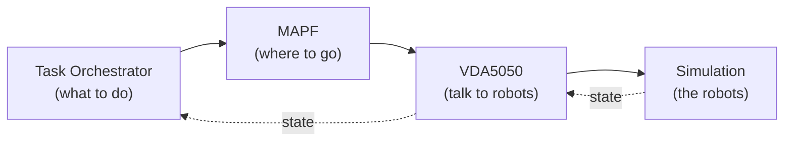

# Architecture

The demo is built from **four core modules**. Tasks flow *down* into robot motion, and
robot state flows *back up* to keep everyone in sync.



## The four modules

| Module | Role | Deep dive |
| --- | --- | --- |
| **Task Orchestrator** | Decides *what* to do — runs the workflow for each task and requests routes. | [Task Orchestrator →](/guide/task-orchestrator) |
| **MAPF** | Decides *where to go* — plans collision-free paths and drives execution. | [MAPF →](/guide/mapf) |
| **VDA5050** | Talks to the robots — relays commands and reports state back. | [VDA5050 →](/guide/vda5050) |
| **Simulation** | Plays the robot fleet so the whole stack runs without hardware. | [Simulation →](/guide/simulation) |

## End-to-end flow

1. A task is submitted.
2. The [**Task Orchestrator**](/guide/task-orchestrator) runs the task's workflow and
   asks MAPF for routes.
3. [**MAPF**](/guide/mapf) plans collision-free paths and drives their execution.
4. [**VDA5050**](/guide/vda5050) relays the movement commands to the robots and reports
   their state back up the chain.
5. The [**Simulation**](/guide/simulation) plays the role of the robot fleet, closing
   the loop for monitoring and the next planning cycle.

## Repository layout

```
ros_industrial_ws/
├── ros_industrial_demo/      # integration hub: launch/teardown
├── ros_industrial_demo_docs/ # ← this documentation site (VitePress)
├── task_orchestrator_repo/   # Task Orchestrator
├── mapf_unified_repo/        # MAPF
├── vda5050_fiware_repo/      # VDA5050 bridge
└── simulation/               # UE5 packaged binary
```

To bring everything up, see [Getting Started](/guide/getting-started) 
