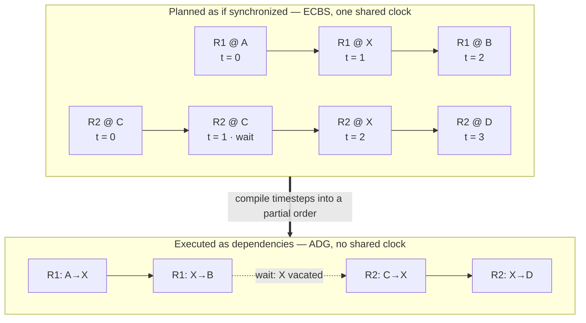

# MAPF (unified)

**Repo:** `mapf_unified_repo` · **Image:** `mapf_unified:latest` · **Container:** `mapf_unified`

Multi-Agent Path Finding. This is a single container that bundles six MAPF-related
services (previously six separate containers) managed by **supervisord**.

## What problem it solves

In a warehouse, many robots share the same aisles and intersections. If each robot plans
its own route, they deadlock and collide. **MAPF plans time-coordinated, collision-free
paths for the whole fleet at once** (ECBS solver), compiles them into an
action-dependency graph the executor can drive, and exposes the map and live robot
positions through Scorpio so planning always uses current state.

> In one line: *many robots, one floor, no collisions — and keep them moving.*

## How it works

MAPF can be operated without any knowledge of its internals, but two principles
explain the behavior of the services described below.

### The mental model

The system deliberately separates *planning* from *execution* and applies a
different assumption about time to each.

1. **Planning assumes a synchronized clock.** The `mapf_solver` plans for the entire
   fleet at once, treating every robot as advancing in lockstep across discrete
   timesteps (`t = 0, 1, 2, …`). Planning against a single shared clock is what
   allows the resulting paths to be guaranteed collision-free. The solver uses the
   ECBS algorithm (Enhanced Conflict-Based Search), which accepts a small, bounded
   loss of optimality in exchange for substantially faster planning.
2. **Execution assumes no shared clock.** In practice, robots advance at different
   and unpredictable rates — one may pause while another proceeds quickly. To stay
   safe under these conditions, the executor converts the timestep-based plan into an
   **Action Dependency Graph (ADG)**: a partial order in which each move waits for
   the specific predecessor action it depends on rather than for a clock value. This
   preserves the solver's collision-freedom regardless of how fast or slowly
   individual robots move.

In short, the fleet is *planned* as though perfectly synchronized, yet *executed* as
a set of dependencies that remain safe under real-world timing.

The diagram below traces one concrete crossing through both phases: robot 1 passes
through the shared node `X` first, so robot 2 is planned to wait one timestep — and at
execution that wait becomes a dependency on robot 1 actually vacating `X`.



### Request → plan → execute

A movement request progresses through the services in a single direction.


1. **Submit.** A client submits node-named tasks — for example, moving a robot from
   `P5` to `P1` — either through the REST API of `movement_request_server` or as a
   `TaskRequest` received by `mapf_mrs`. Both entry points place the request
   onto a shared Redis queue (`mapf_tasks`); neither performs any planning itself.
2. **Plan.** The `adg_executor` retrieves the queued batch, translates the node names
   into map coordinates, and requests a plan from `mapf_solver`. The solver returns,
   for each robot, a sequence of steps stamped with the timestep at which each step
   occurs.
3. **Compile.** The `adg_executor` builds the Action Dependency Graph from those
   steps. It links each robot's own moves in sequence and adds a cross-robot
   dependency wherever one robot must vacate a node before another is permitted to
   enter it.
4. **Execute.** The executor dispatches each action that is *ready* as a VDA5050
   order. An action becomes ready once the actions it depends on across other robots
   have completed; to avoid unnecessary stalls, each robot may have up to three of
   its own upcoming moves queued in advance. As robots report their progress,
   completed actions release the actions that depend on them, and execution proceeds
   incrementally until the task is complete.

Throughout execution, the task's status — `QUEUED`, `IN_PROGRESS`, `COMPLETED`, or
`FAILED` — is recorded in Redis under the task identifier, and this is the value
returned by `/mapf/monitor_task`.

The map is defined by a single RMF YAML file listing named nodes and the lanes
between them. It is shared by two consumers: `mapf_solver` reads it for path
planning, and `fiware_map_server` publishes it to the context broker so that
other services can query the current map.

## Services inside the container

| Service | Port(s) | Purpose |
| --- | --- | --- |
| `fiware_map_server` | `7073` (HTTP/Flask) | Uploads maps to the context broker |
| `load_maps` | — (one-shot) | Loads YAML maps at startup |
| `mapf_solver` | `8888` (HTTP) | MAPF path-planning solver (ECBS) |
| `adg_executor` | `6333` (HTTP), `1932` (MQTT) | ADG execution engine |
| `mapf_mrs` | `1933` (MQTT) | Movement request server |
| `movement_request_server` | `8009` (HTTP/FastAPI) | REST API for movement requests |

```
┌─────────────────────────────────────────────────────────┐
│                   mapf_unified container                │
│  supervisord (process manager)                          │
│  ├── fiware_map_server     → :7073 (HTTP/Flask)         │
│  ├── load_maps             → (one-shot at startup)      │
│  ├── mapf_solver           → :8888 (HTTP)               │
│  ├── adg_executor          → :6333 (HTTP), :1932 (MQTT) │
│  ├── mapf_mrs              → :1933 (MQTT)               │
│  └── movement_request_svr  → :8009 (HTTP/FastAPI)       │
│                                                         │
│  External deps: mosquitto · redis · scorpio · rabbitmq  │
└─────────────────────────────────────────────────────────┘
```

The launcher's port-`8888` health gate is what tells it MAPF is ready.

## Role in the system

The Task Orchestrator asks MAPF for collision-free paths; the solver plans them, the
ADG executor drives execution, and the MRS/movement gateway turn plans into movement
requests that ultimately become VDA5050 orders. Maps and robot positions are exchanged
via the context broker.

## MAPF Simulation and Testing

The quickest way to *see* MAPF working — no full stack required — is to send one
problem straight to the solver and render the collision-free plan as a GIF. See the
**MAPF Solver Test + Visualization** guide in the `ros_industrial_demo` repository,
under `test_scripts/mapf/README.md`.


### Demo


```bash
cd ~/ros_industrial_ws/ros_industrial_demo/test_scripts/mapf
./loop_tasks.sh 24 1
```


## Key environment variables

| Variable | Default | Description |
| --- | --- | --- |
| `MQTT_SERVER_HOST` | `mosquitto` | MQTT broker hostname |
| `REDIS_HOST` | `redis` | Redis hostname |
| `CONTEXT_BROKER_HOST` | `scorpio` | context broker |
| `AMQP_HOST` | `rmf2_broker-rabbitmq-1` | RabbitMQ hostname |
| `BUILDING_NAME` | `warehouse_os_setup_v2` | Map / building name |
| `MAP_SERVER_PORT` | `7073` | map server port |

See `.env` in the `mapf_unified_repo` for the full list. 
