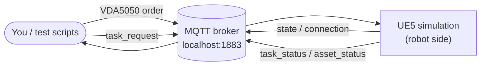

# Simulation (UE5)

The UE5 simulation spins up the **robot side** of the system:

- **AGVs** — the mobile robots, driven with **VDA5050** `order` messages.
- **Devices** — robotic arms, conveyors and racks, driven with `task_request` messages.

You control all of it over **MQTT** on the broker at `localhost:1883`.




The simulation starts in fullscreen mode by default.

- Move: `W A S D`
- Toggle fullscreen: `Alt + Enter`
- Map marker: `M`


## Control an AGV (VDA5050) via Mqtt

Drive an AGV by publishing a VDA5050 **order** to:

```
uagv/v2/Manufacturer/<serial>/order
```

```json
{
  "headerId": 1234,
  "timestamp": "2026-06-05T06:32:29.962Z",
  "version": "2.0.0",
  "manufacturer": "Manufacturer",
  "serialNumber": "10",
  "orderId": "order-<uuid>",
  "orderUpdateId": 1,
  "nodes": [
    {
      "nodeId": "P123",
      "sequenceId": 0,
      "released": true,
      "nodePosition": {
        "x": -0.6,
        "y": -49.3,
        "theta": 0.0,
        "allowedDeviationXY": 0.5,
        "allowedDeviationTheta": 0.5,
        "mapId": "urn:ngsi-ld:Map:warehouse_os_setup"
      },
      "actions": []
    }
  ],
  "edges": []
}
```

The AGV reports back on these topics:

| Topic | Direction | Purpose |
| --- | --- | --- |
| `uagv/v2/Manufacturer/<serial>/order` | → sim | Drive the AGV to a node |
| `uagv/v2/Manufacturer/<serial>/state` | sim → | Pose, `lastNodeId`, `driving`, battery, … |
| `uagv/v2/Manufacturer/<serial>/connection` | sim → | Online / offline |

The AGV has **arrived** when its `/state` reports `lastNodeId == <your nodeId>` and
`driving == false`:

```json
{
  "agvPosition": { "x": 4.39, "y": -3.85, "theta": -1.74 },
  "batteryState": { "batteryCharge": 100.0, "charging": false },
  "driving": false,
  "lastNodeId": "P123",
  "operatingMode": "AUTOMATIC",
  "orderId": "order_1780640519",
  "serialNumber": "10",
  "timestamp": "2026-06-05T06:32:29.962Z",
  "version": "2.0.0"
}
```

## Control a device (`task_request`) via Mqtt

Trigger a device action by publishing a `TaskRequest` to:

```
asset/<asset_id>/task_request
```

```json
{
  "id": "urn:ngsild:Task:001:TaskRequest",
  "task_type": "liftrack",
  "task_command": "liftrack",
  "asset_id": "1",
  "task_params": {}
}
```

::: tip What actually matters
Only **`task_type`**, **`task_command`** and the target **`asset_id`** drive behaviour.
`task_command` defaults to `task_type`; the rest of the payload is along for the ride.
:::

The `task_type` you send and the `asset_id` you address it to go together:

| `task_type` | Addressed to (`asset_id`) | Action |
| --- | --- | --- |
| `liftrack` / `droprack` | the **AGV serial** (e.g. `1`, `10`) | AGV lifts / drops the rack at its current spot |
| `depalletize` | a manipulator — `ManipulatorRobot1`, `ManipulatorRobot2` | Robot arm performs a pickup |
| `dropoff` | a conveyor — `Conveyor1` … `Conveyor3` | Conveyor accepts the dropoff |

The device reports back on these topics:

| Topic | Direction | Purpose |
| --- | --- | --- |
| `asset/<asset_id>/task_request` | → sim | Trigger an asset action |
| `asset/<asset_id>/task_status` | sim → | Task lifecycle: `STARTED` / `RUNNING` / `COMPLETED` / `FAILED` / `REJECTED` |
| `asset/<asset_id>/asset_status` | sim → | Per-asset heartbeat |

The action is **done** when `task_status` reports `COMPLETED`:

```json
{
  "id": "urn:ngsild:Task:task_Depalletize001:TaskStatus",
  "task_type": "Depalletize",
  "status": "RUNNING",
  "asset_id": "",
  "task_params": {},
  "timestamp": "2025-01-09T15:30:15Z",
  "task_expected_start": "2025-01-09T14:30:15",
  "task_expected_end": "2025-01-09T15:30:15"
}
```

`asset_status` (heartbeat):

```json
{
  "asset_id": "MANIP1",
  "asset_type": "Manipulator",
  "status": "BUSY",
  "timestamp": "2025-01-09T15:30:10Z",
  "current_task": "urn:ngsild:Task:task_Depalletize001:TaskRequest",
  "error_code": [0],
  "error_message": []
}
```

## Full demo walkthrough

`demo_single_agv.py` runs one AGV through a complete **pick → manipulate → conveyor**
cycle. Each step below is one MQTT publish (and the wait for its completion).

### Run it

**Prerequisites:** the UE5 sim must be running (the demo only *publishes* to it), and you
need the `paho-mqtt` Python package.

```bash
# 1. Make sure the sim is up (demo launcher, or directly):
~/ros_industrial_ws/simulation/Linux/RMF2_SIM.sh

# 2. In another terminal, go to the simulation test scripts:
cd ~/ros_industrial_ws/ros_industrial_demo/test_scripts/simulation

# 3. One-time: install the MQTT client
pip install paho-mqtt

# 4. Run the full demo (default AGV serial 10):
./demo_single_agv.py

#    ...or target a specific AGV serial:
./demo_single_agv.py 12

#    ...then put the rack back and park:
./demo_single_agv_reset.py
```

::: tip
If `./demo_single_agv.py` isn't executable, run it with `python3 demo_single_agv.py`
instead. The script connects to the broker at `localhost:1883` and prints each step as it
publishes and waits for completion.
:::

**1. Drive to the rack pickup point** — `send_agv 10 P123`

**2. Lift the rack** — `send_device 10 liftrack` (addressed to the AGV serial)


**3. Drive to the manipulator station** — `send_agv 10 P501`

**4. Depalletize — load cargo onto the rack** — `send_device ManipulatorRobot1 depalletize`


**5. Drive to the conveyor** — `send_agv 10 P619`

**6. Conveyor dropoff** — `send_device Conveyor1 dropoff`


**7. Drive to the drop point** — `send_agv 10 P68`

**8. Drop the rack** — `send_device 10 droprack`


## Drive it with the test scripts

Helper scripts in `test_scripts/simulation/` wrap all of the above (`lib.py`, a thin
`paho-mqtt` client):

```bash
cd ~/ros_industrial_ws/ros_industrial_demo/test_scripts/simulation
pip install paho-mqtt                 # one-time

# --- control an AGV ---
./send_agv.py 10 P123                 # move AGV serial 10 to waypoint P123
./send_agv.py 10 -30.8 -49.3          # ...or raw x,y in map-frame metres

# --- control a device ---
./send_device.py 10 liftrack          # rack lift (addressed to the AGV serial)
./send_device.py ManipulatorRobot1 depalletize
./send_device.py Conveyor1 dropoff

# --- full event-driven demos (each step waits on the live MQTT feed) ---
./demo_single_agv.py [serial]         # pick -> manipulate -> conveyor cycle (default serial 10)
./demo_single_agv_reset.py [serial]   # put the rack back and park
```

The steps are **event-driven**, not timed: `send_agv` blocks until the AGV's `/state`
reports it arrived; `send_device` blocks until `asset/<id>/task_status` reports
`COMPLETED`.

## Watch the traffic

```bash
./watch.py                            # all topics
./watch.py asset 1                    # one device
./watch.py vda 10                     # one AGV
# ...or with the raw client:
mosquitto_sub -h localhost -p 1883 -t '#' -v
```
