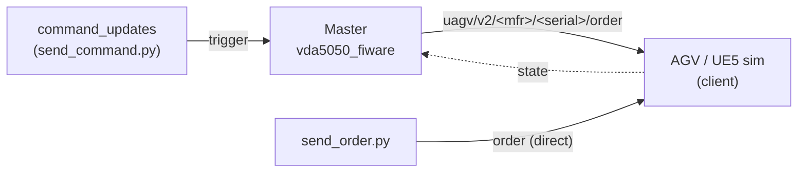

# VDA5050

**Repo:** `vda5050_fiware_repo` · **Image:** `vda5050_fiware:latest` · **Container:** `vda5050_fiware`

## What is VDA5050?

[VDA5050](https://www.vda.de/en/topics/automotive-industry/vda-5050) is an open,
vendor-neutral standard (by the German VDA) defining a common **interface between a
central master control and Automated Guided Vehicles (AGVs / AMRs)**. It runs over
**MQTT** and uses JSON messages — chiefly `order` (the route/actions a robot should do),
`state` (what the robot reports back), `connection`, and `instantActions` — so robots
from different vendors can be coordinated through one protocol. This project targets
**v2.0.0** of the spec.

The bridge between **VDA5050** AGV communication (orders & state over MQTT) and the rest
of the system. It plays the VDA5050 **master**: it issues/stitches orders to AGVs and
tracks their state.

> 🚧 **Active development.** The current VDA5050 integration is an early, evolving
> implementation. It's good enough to drive robots over MQTT for the demos, but order
> stitching, state handling, and the broader data-model mapping are being actively
> reworked. Expect this to grow — see [Future development](#future-development).

## Master vs Client

VDA5050 is a master/client protocol:

| Side | Who plays it | Responsibility |
| --- | --- | --- |
| **Master** | this bridge (`vda5050_fiware`) | Issues/stitches **orders**, tracks AGV **state**. |
| **Client** | the AGVs — real robots or the [UE5 simulation](/guide/simulation) | Receives orders over MQTT, executes them, publishes **state** back. |

## How it fits (MQTT layer)

Everything here happens over Mosquitto (`:1883`). The master publishes orders to the AGV
and listens for state; you can inject at two points:



- **`send_command.py`** — fakes the master's command channel (`command_updates`); the
  master looks up each node in its map and emits the real stitched order.
- **`send_order.py`** — publishes a VDA5050 order **straight to the AGV/sim**, bypassing
  the master entirely. The simplest way to make a robot move.

## Prerequisites

On the same Docker network (`rmf2_broker_rmf-network`):

- **mosquitto** — MQTT broker (`:1883`)

## Run

Use **`start_environment_tmux.sh`** as the main launcher — it brings up the whole
environment, and VDA5050 comes up as part of it (step 6):

```bash
cd ~/ros_industrial_ws/ros_industrial_demo/launch
./start_environment_tmux.sh


# The standalone control script just starts the VDA5050 bridge on its own, kept here
# for reference, but prefer the launcher above
# ./rmf2_res_vda5050_control.sh start    # starts only the VDA5050 bridge
```

## Try it directly (send to test)


Helper scripts live in `~/ros_industrial_ws/ros_industrial_demo/test_scripts/vda5050`
(one-time: `pip install paho-mqtt`).

```bash
cd ~/ros_industrial_ws/ros_industrial_demo/test_scripts/vda5050

# creates a command_updates to the vda5050 master (MQTT)
./send_command.py 10 P619 P585 P551 P517 P483 P484 P518 P552 P586 P620

# drive the sim directly, vda5050 client (MQTT)
./send_order.py 10 P619 P585 P551 P517 P483 P484 P518 P552 P586 P620
```

> **Why these P-nodes?** `send_command.py` needs an **edge** between each consecutive pair —
> the map is a **34-wide grid**, so `P<n>` only links to `P<n±1>` (row) and `P<n±34>` (column).
> The route above is one connected chain. An arbitrary jump (e.g. `P123 P501 P619`) has no
> edge, so the master drops the rest and the robot stops at the first node. `send_order.py`
> sends directly to the simulation, bypassing the master, so any list of P-nodes works.

Watch what's happening on the wire:

```bash
mosquitto_sub -h localhost -p 1883 -t 'uagv/#' -v    # all VDA5050 traffic
```

> The master only emits an order from `send_command.py` once the AGV is **discovered**
> (online and publishing state) and every node exists in its loaded map. If nothing
> moves, fall back to `send_order.py`, which talks to the AGV directly.

## Future development

This bridge is the seam where heterogeneous AGVs become controllable through one
interface, and it's where most upcoming work lands:

- **Robust order stitching** — hardening sequence-id / orderId / updateId handling so
  long order streams never corrupt.
- **Fuller VDA5050 coverage** — more actions, instantActions, and richer state.
- **Cleaner data-model mapping** — a consistent AMR model so dashboards and MAPF read
  one shape regardless of robot vendor.

> 🧭 **Future implementation target.** The direction for this bridge is the
> [ros-industrial/vda5050_core](https://github.com/ros-industrial/vda5050_core)
> project — a VDA5050 implementation we intend to build on going forward.

## Troubleshooting

```bash
docker logs vda5050_fiware --tail 50          # expect periodic "state" lines
```

If robots never move, confirm the bridge and the AGV/sim can both reach
`mosquitto:1883` on the shared network, and that the sim is online.